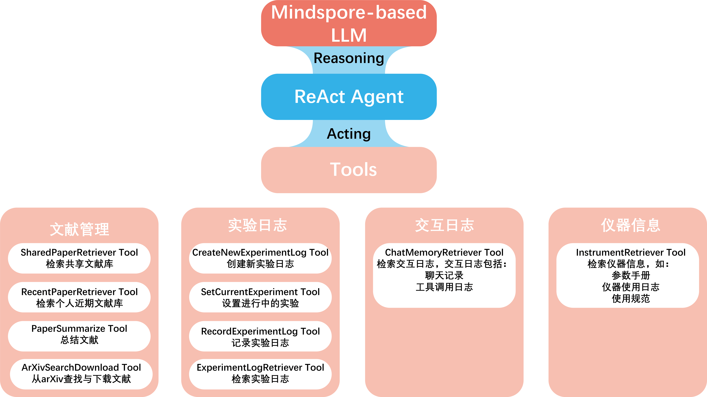

简体中文|[English](README_EN.md)

# Labridge

## _搭建科学实验室沟通合作的桥梁_ 

**Labridge**致力于利用大模型整合与管理科学实验室的知识财富，包括文献内容、实验记录、仪器信息等，
以促进研究者们之间的沟通合作，加速对于新人研究者的培养，为实验室搭建沟通合作的桥梁。


## 开发框架
Labridge基于 `Llamaindex` 与 `Mindspore`, 使用ReAct + CoT Prompt框架进行实现。



## 项目文档
我们提供详细的中英文项目文档与源码文档，细节请参阅如下文档：

**中文文档**

[中文文档地址一](https://scramblingsnail.github.io/Labridge/)

[中文文档地址二](https://labridge.readthedocs.io/zh-cn/latest/)

**英文文档**

[英文文档地址一](https://scramblingsnail.github.io/Labridge/en/)

[英文文档地址二](https://labridge.readthedocs.io/zh-cn/latest/en/)

## 环境
`python==3.8`
`CUDA>=11.8`
`node=v18.12.0`

## Requirements (Mnidspore版本)
[requirements_mindspore](./requirements/requirements_mindspore.txt)

## Requirements (Pytorch版本)
[requirements](./requirements/requirements.txt)

## 模型设置
在[模型配置文件](./model_cfg.yaml)中配置相应的深度学习框架后端、LLM模型名、Embedding模型名等参数。

建议自行从Huggingface上下载相应模型到本地。

## 服务端与客户端

### 运行服务端
- 方式一：在终端运行：
```shell
python run_server.py --host={Your server host} --port={Your server port}
```

- 方式二：执行shell脚本：
```shell
cd scripts
export LABRIDGE_SERVER_HOST={Your server host}
export LABRIDGE_SERVER_PORT={Your server port}
bash run_server.sh
```

注：此处说明非 OrangePi 部署。
使用Orange Pi部署需要额外GPU服务器，以及Orange Pi与GPU服务器之间的HTTP通信，Orange Pi 负责Embedding与OCR等轻量级任务，GPU服务器负责LLM计算任务。
请参考[Remote LLM源代码](./labridge/models/remote/remote_models.py)与[Remote LLM server源代码](./labridge/models/remote/remote_server.py)

### 运行web前端

```
python -m http.server -d .\web-frontend-2\dist\
```

浏览器访问 `http://localhost:8000/`

Web客户端具体细节请参考
[Web](./docs/zh/interface/web_ui.md)


### 服务端与客户端通信说明
服务端与客户端之间通过 HTTP 通信，细节请参考[通信说明](./docs/zh/interface/server-client.md)。

### 客户端界面
Labridge提供Web与App版的客户端界面，请在客户端设置相应的服务器地址。


App客户端具体细节请参考
[App](./docs/zh/interface/app.md)
