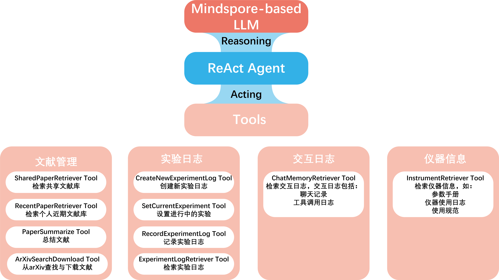

[简体中文](README.md)|English

# Labridge

## _Construct the bridges of a science laboratory_ 

**Labridge** is committed to build a bridge for communication and collaboration among all scientific laboratories, 
enhancing the efficiency of researchers and catalyzing the birth of new knowledge.

## Frameworks
Labridge is based on `Llamaindex` and `Mindspore` framework, and the ReAct + CoT Prompt framework is used to
construct agents.

## User interface
Labridge provide user interfaces in Web version and App version.

[Web](./docs/en/interface/web_ui.md)

[App](./docs/en/interface/app.md)

## Environment

`python==3.8`
`CUDA>=11.8`
`node=v18.12.0`

## Requirements (Mnidspore version)
[requirements_mindspore](./requirements/requirements_mindspore.txt)

## Requirements (Pytorch version)

[requirements](./requirements/requirements.txt)

## Project documents
We provide elaborated project documents and code documents, refer to the documents below for details.

**ZH Docs**

[ZH doc website 1](https://scramblingsnail.github.io/Labridge/)

[ZH doc website 2](https://labridge.readthedocs.io/zh-cn/latest/)

**EN Docs**

[EN doc website 1](https://scramblingsnail.github.io/Labridge/en/)

[EN doc website 2](https://labridge.readthedocs.io/zh-cn/latest/en/)
