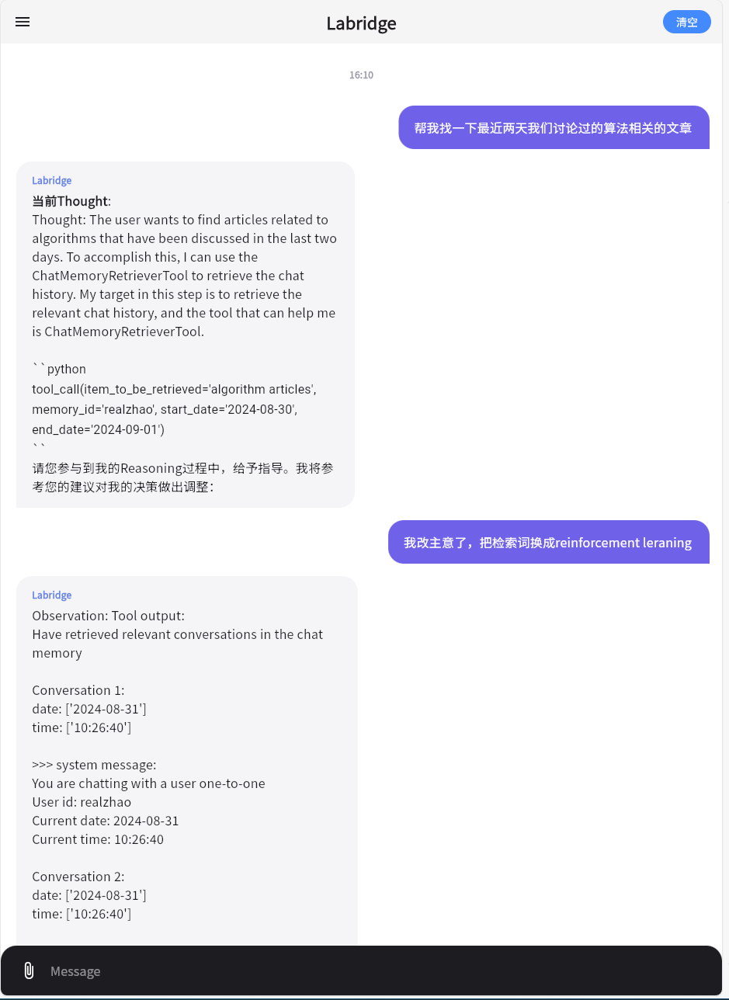
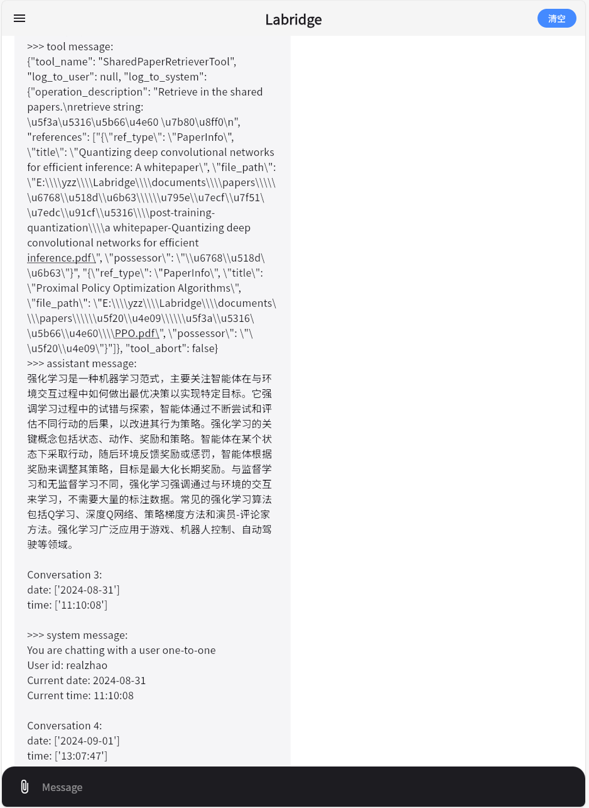
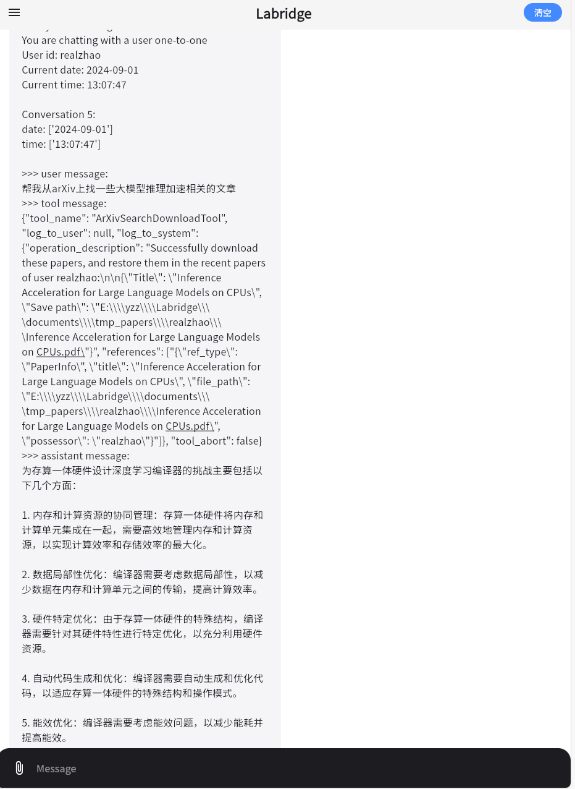
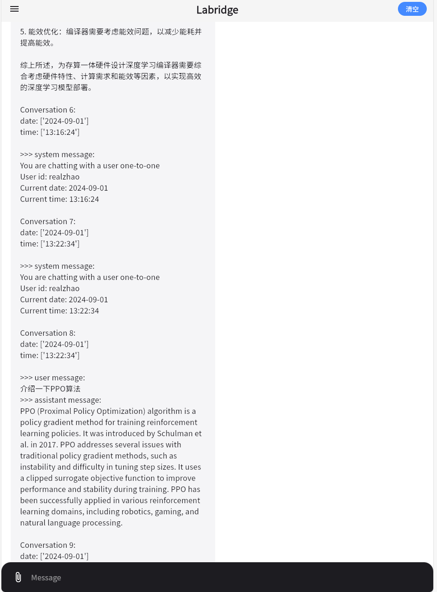

# Comment in Acting phase
You can comment the Labridge's action in the acting phase if you open the `comment mode`

## Comment Settings
In this example, we open both `comment mode` and `instruct mode`

## Example

