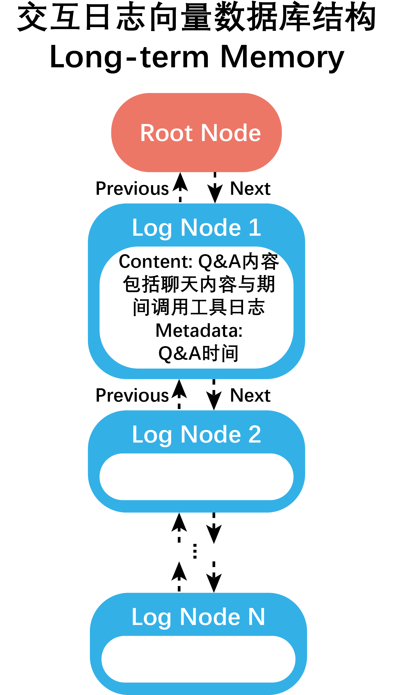

# Interaction log storage structure

Interaction logs use a single round of **QA** as the basic unit, containing chat records and tool logs during the period. 
An independent vector database is stored for each member or member group

The structure of each vector database is similar to that of a doubly linked list.

- The initial node (first node) stores the object to which the database belongs and the description of the database. 
Additional information includes the creation time of the database.
- The newly added QA log unit will be added as the last node in the linked list structure. 
This node stores the QA logs, with additional information including the occurrence time (date time) of the QA.

After each interaction with a member or in the group chat of the member group, 
the interaction logs will be recorded in the corresponding vector database and persisted.

Refer to **Code docs** `Func_modules.memory.chat.store`