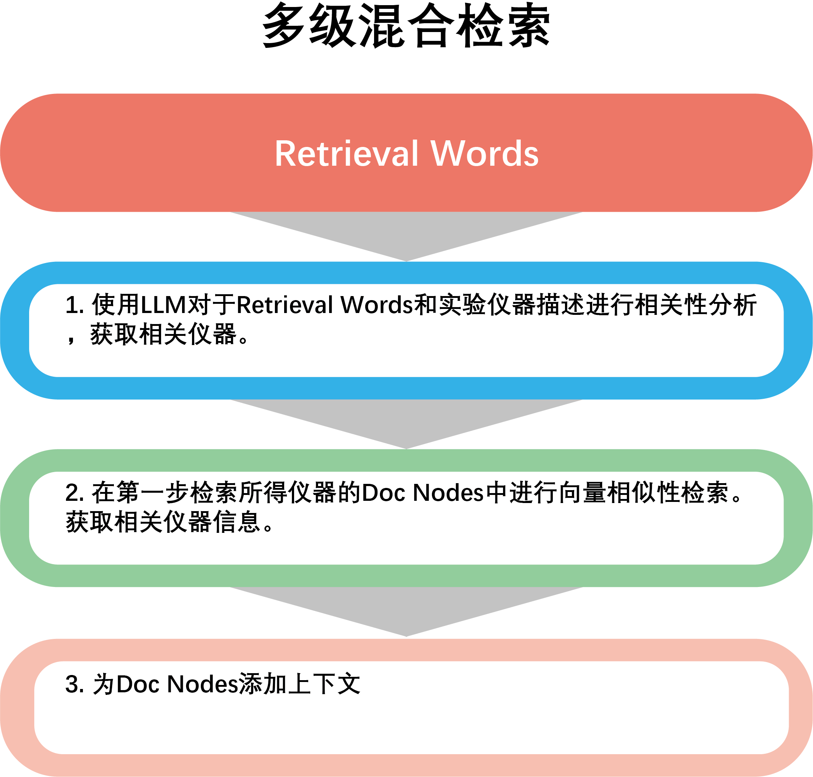

# Instrument info retrieval

Labridge uses a multi-level retrieval approach to retrieve relevant instrument information.

## The first retrieval step
In the first step of retrieval, Labridge uses **LLM** to score the relevance between the query text 
and the experimental instruments (based on instrument descriptions), selecting the top `instrument_top_k` 
most relevant instruments.

## The second retrieval step
Limit the search scope to the instruments obtained from the first step of retrieval. 
Perform a similarity retrieval within the information of these instruments to get the `top_k` 
most relevant pieces of information to the query vector. 
These pieces of information are provided to LLM as reference information for the retrieval results.

For more details about instrument retrieval, please refer to **Code docs** `Func_modules.instrument.retrieve.instrument_retrieve`
