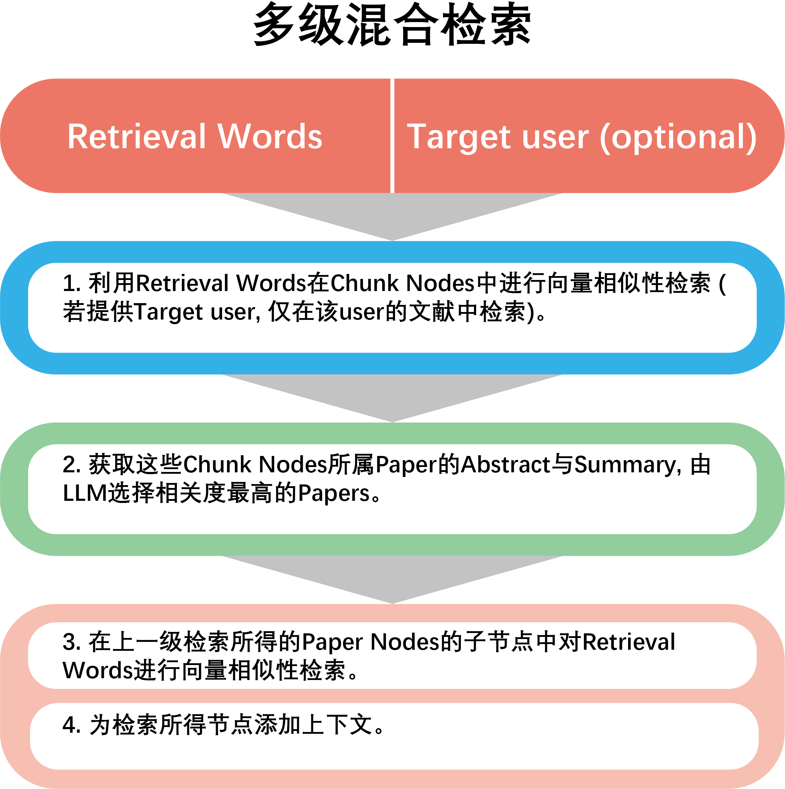

# Shared paper database retrieval

Labridge will retrieve in the [Constructed](store.md) shared paper database for the relevant information.

We have employed a multi-level, hybrid search approach to enhance the accuracy of the retrieval results.
Refer to **Code docs** `Fun_modules.paper.retrieve.paper_retrieve` for details.

### The first retrieval step
In the first step of the retrieval process, we retrieve the `vector_similarity_top_k` text blocks most similar to 
the question vector in the content vector database of the shared literature library, and then get the paper nodes that they belongs to.
If specific `user_id` is given, the retrieval range is confined to this user's papers.

### The second relevance analysis step
Within the scope of the papers identified in the first step of retrieval, 
We then use **LLM** to score the relevance of their summaries to the question text. 
From this scoring, we obtain the `docs_top_k` documents with the highest relevance scores.

### Final retrieval step
Within the scope of the papers that has been filtered in the second step, 
we search for the `re_retrieve_top_k` text blocks most similar to the question vector within the text of these documents.
Since this retrieval is the final fine-grained search, the text provided to the Embedding model during this process 
consists no additional metadata.

### Add context and summary text
Finally, we can choose to add context to the retrieved text blocks, as well as the summaries of the documents they belong to. 
These contents are then provided as the final search results to the **LLM**.