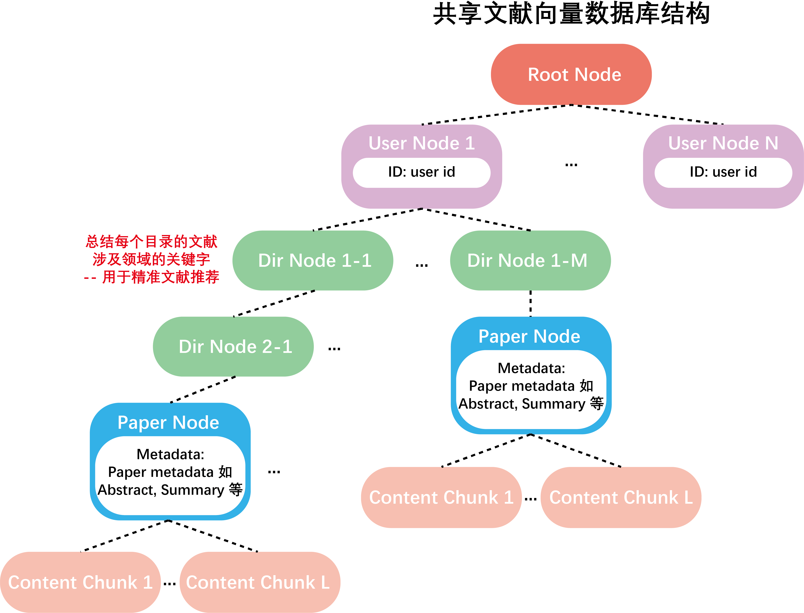
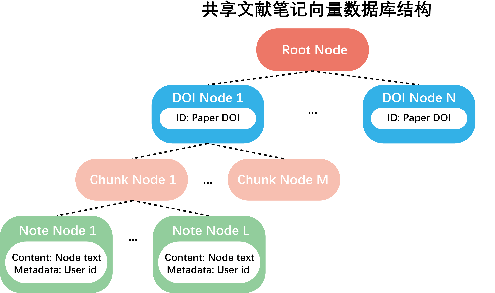

# Construction of shared paper database

The original files of the shared paper database are stored in `documents/papers`. 
The first-level subdirectories of this paper repository are the `user_id` of the lab members.

Labridge utilizes the [Parsed](parse.md) content and information to construct 
a comprehensive and detailed shared literature database, supporting various retrieval methods.

## **Paper content vector database**
Labridge constructs a vector database (VectorIndex) for all shared papers and records the metadata of each paper, 
as well as the owner of the paper.

Refer to **Code docs** `Func_modules.paper.store.shared_paper_store` for details of the construction of the content vector database.

### **Summarize**
Labridge uses **LLM** to summarize the `MainText` and `Methods` sections of each paper added to the 
shared literature database and constructs a corresponding SummaryVectorIndex.
The summary of the `MainText` focuses on the overall content of the article, main innovations, etc., 
while the summary of the `Methods` focuses on the technical approaches used in the article.

- Refer to **Code docs** `Func_modules.paper.synthesizer.summarize` for details about content summarizing.
- Refer to **Code docs** `Func_modules.paper.store.paper_store` for details about the constructed SummaryVectorIndex. 
- The prompts for summarizing `MainText` and `Methods` is shown in 
**Code** `func_modules.paper.prompt.synthesize.paper_summarize`

### **Summarize the paper directories**
Labridge uses **LLM** to recursively generate summaries for each level of the paper repository’s directory, 
such as the research fields involved in the papers under each directory. 
This information serves as an important reference for Labridge to recommend papers to lab members 
and to insert new papers into the shared paper repository.

For details about summarizing the paper directories, refer to **Code docs** `Func_modules.paper.store.paper_store`

## **Shared paper note vector database**
The shared paper note vector database is structured as follows. It is structured as a flatten tree, nodes in the first
layer record the paper DOI. Each DOI node represents a unique paper. The child nodes of a DOI node record non-overlapped paper content
chunks with short length, for the sake of a fine-grained retrieval. The bottom nodes record the notes of users.

