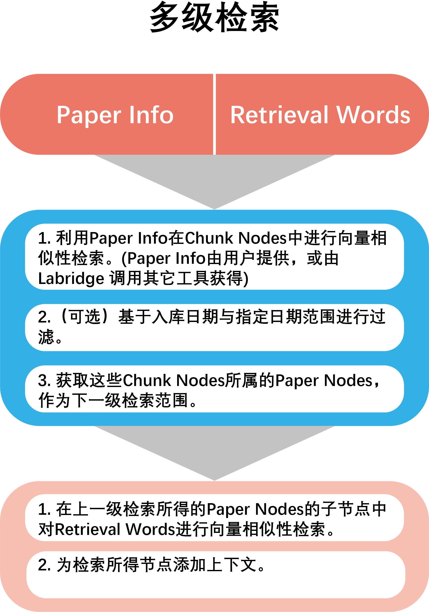

# Retrieval of personal recent papers
For the retrieval of personal  recent paper database, we also use a multi-level hybrid search. 
The usage scenario for personal recent paper database is more focused on inquiries about a specific paper, 
with high requirements for timeliness. Therefore, we adopt a strategy of fuzzy search to locate the paper range, 
followed by further similarity search.

## Fuzzy search to determine the document range
Firstly, Labridge will determine the general information (PaperInfo) of 
the required paper (such as title, file path, etc.) from the tool invocation logs and chat records. 
Based on this PaperInfo, Labridge performs a similarity search in the personal temporary document library to 
obtain relevant nodes. 
The documents to which these nodes belong will be the search range for the next step of Labridge’s retrieval.

## Timestamp filtering
Labridge can provide start and end times to further narrow the search range.

## Further retrieval
In this retrieval step, Labridge conducts similarity searches within the scope of papers identified in the previous step, 
based on the user’s search text. 
It then obtains the most relevant content nodes (doc nodes) from these papers.

## Add context
You can choose to add context to the retrieved results and pass them as the final result to the **LLM** 
to avoid incomplete content caused by text chunking.
