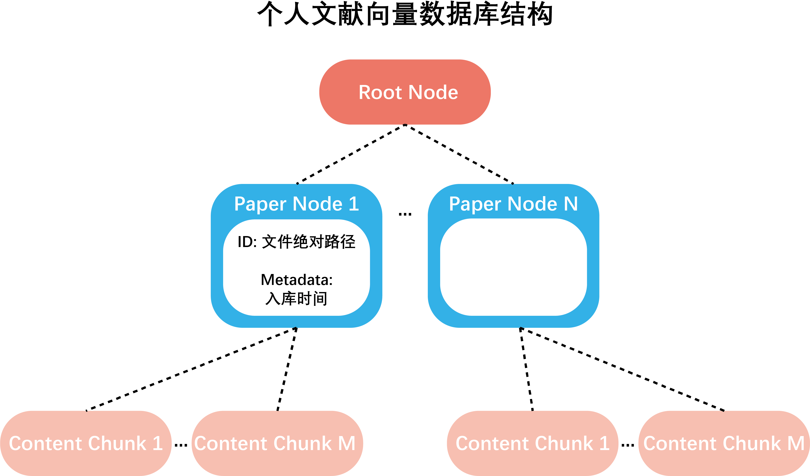

# Structure of personal recent paper database

Each personal recent paper database is a vector database.

- The original files of a user-specific recent paper database are stored in `documents\tmp_papers\{user_id}`
- Each recent paper database has a root node, and all paper nodes are child nodes of the root node.
- The ID of a paper node is the absolute path of the document file. 
Additional information includes the time (`date` `time`) when the file was stored in the recent paper repository. 
Timestamp information can be used for time filtering during retrieval.
- All content nodes (doc nodes) of each paper are inserted as child nodes of the corresponding paper node.
- If the member calls the paper summary tool, the corresponding literature summary text will be added as a child node 
to the corresponding paper node.