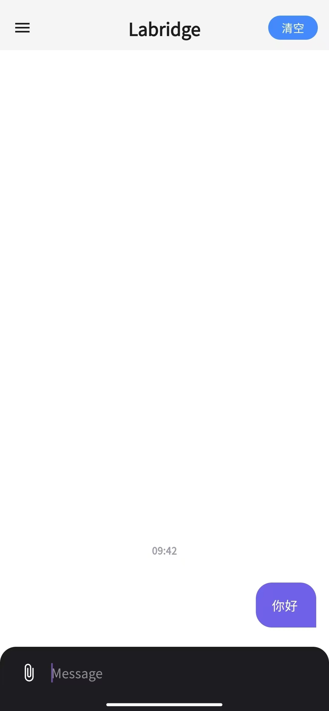
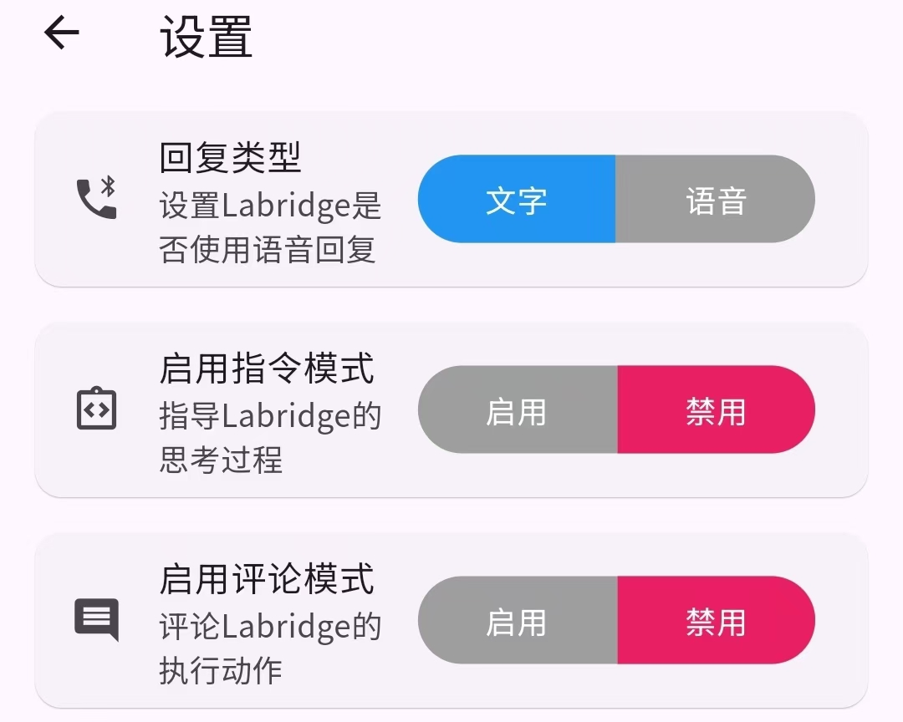
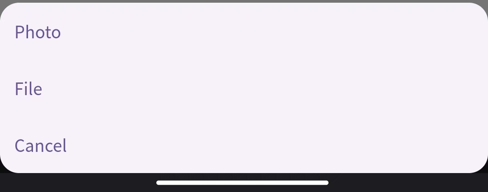

# App user interface

We provide an App for the interaction between users and Labridge, as shown below.

## Multimedia interaction

Labridge supports multimedia interaction with users, such as text, speech, and files.

Labridge provides developer mode that makes users available to intervening the agent's thoughts and actions.

## Description of App codes and compilation