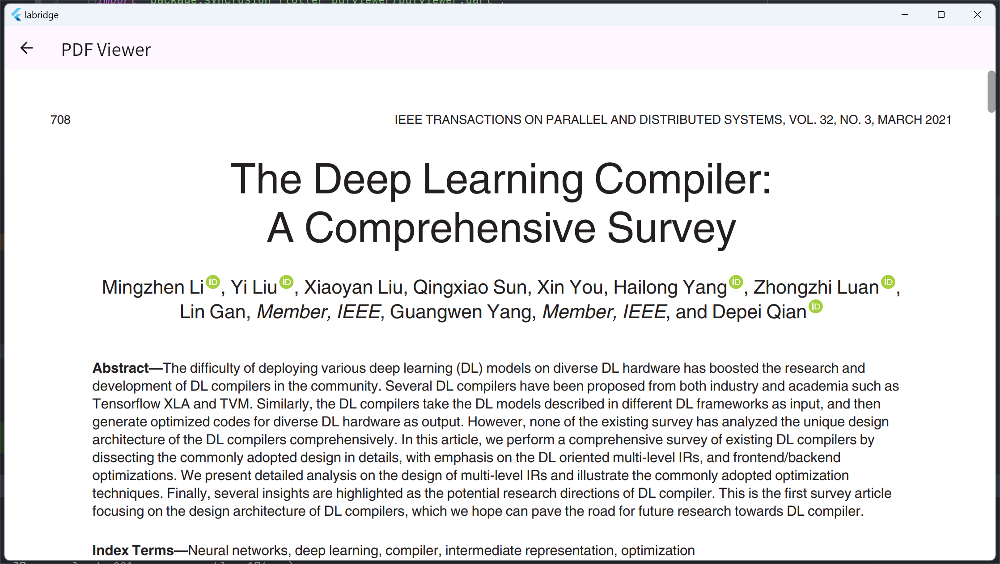

# App user interface

We provide an App for the interaction between users and Labridge, as shown below.


## Multimedia interaction

Labridge supports multimedia interaction with users, such as text, speech, and files.

Labridge provides developer mode that makes users available to intervening the agent's thoughts and actions.


## Support viewing reference files



## Description of App codes and compilation

The app is developed using the Flutter framework and supports multiple platforms including Windows, MacOs, Android, Web, iOS, etc. Currently, it has been fully tested on Windows, Andriod, and Web.

### Environment

- Flutter (Channel stable, 3.24.0, on Microsoft Windows [版本 10.0.22631.4169], locale zh-CN)
- Windows Version (Installed version of Windows is version 10 or higher)
- Android toolchain - develop for Android devices (Android SDK version 33.0.0)
- Chrome - develop for the web
- Visual Studio - develop Windows apps (Visual Studio Community 2022 17.11.3)
- Android Studio (version 2024.1)
- VS Code (version 1.93.0)

### Core

Core code is in `/app/lib`:

```sh
lib
│  chat_agent.dart
│  main.dart
│  settings.dart
│  settings_route.dart
│
└─message
        audio_message.dart
```

The `main.dart` is the main page UI file, `chat_agent.dart` is responsible for communicating with the large model and processing user requests, and the remaining files are used to maintain the UI status.

### Compile

This app is developed with Flutter standards. For the compilation process, please refer to the [Flutter official documentation](https://docs.flutter.dev/deployment/android)
