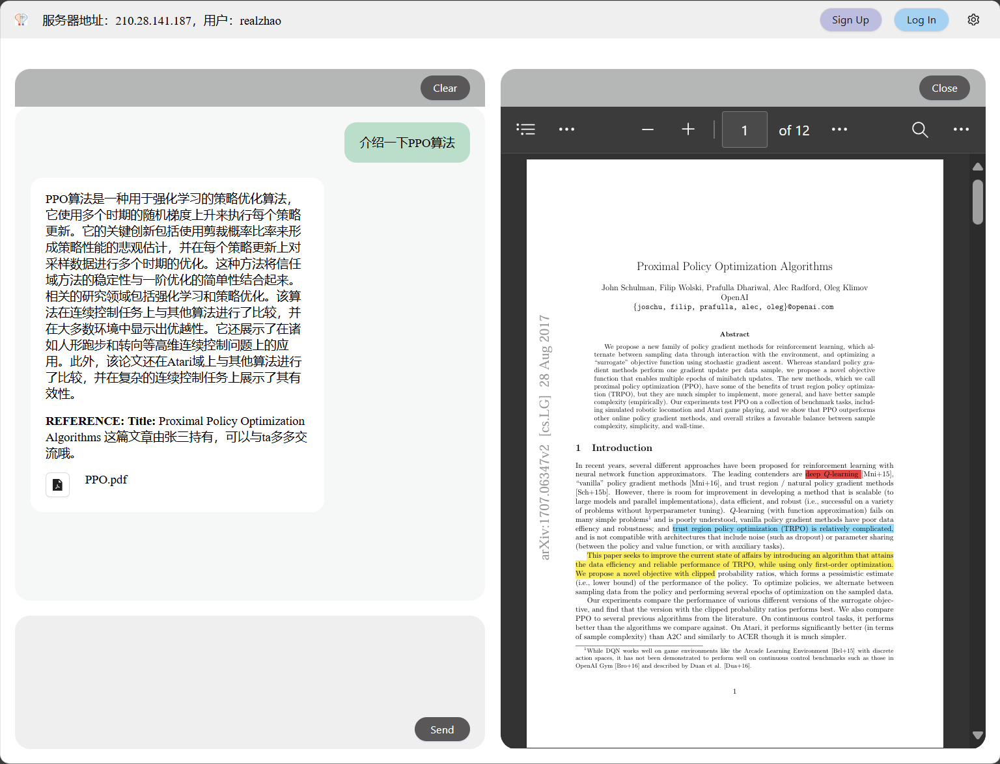
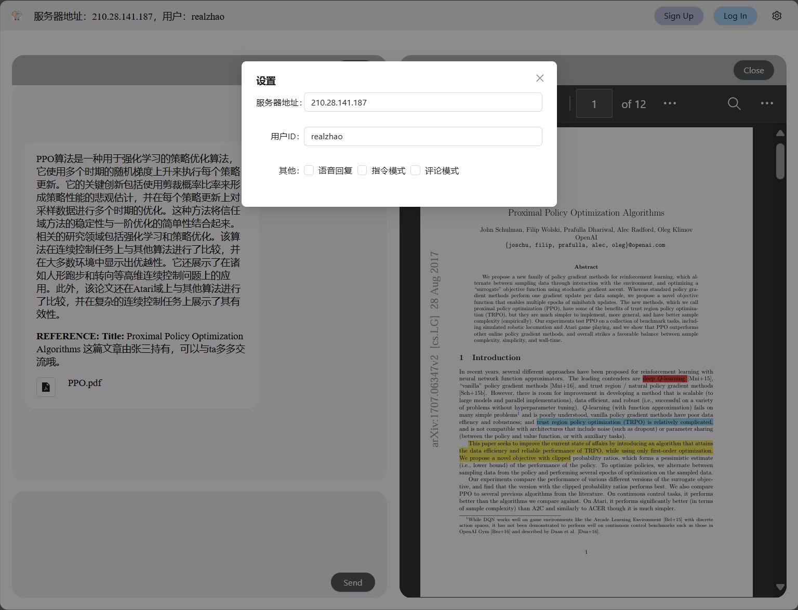
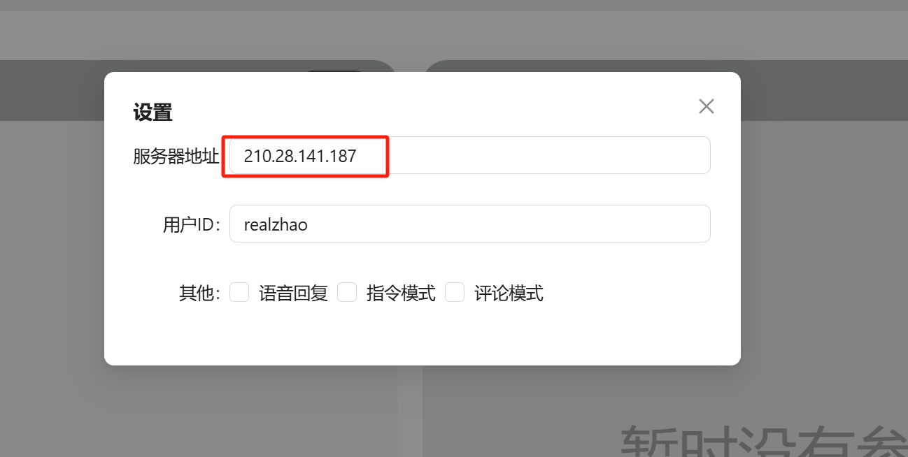

# Web user interface


We provide an web interface for users to interact with Labridge, as following image. 
In the top tool bar user can read current server address, read current user account, sign up, log in 
or change settings. In left panel, user can input and send message to Labridge, read chat history. 
In right panel, selected article will be displayed here and user can read it in situ.



Dialog to change settings:



## Web codes and compilation

The web project code is located at `web-frontend`. Vite + React + Typescript are used.

Preview:

```ps1
python -m http.server -d .\web-frontend\dist\
```

Then open `http://localhost:8000/` in browser. The server address need to be changed, change it in settings:




Compile:

```ps1
cd web-frontend
npm run dev # dev mode, to change and preview 
npm run build # build, to release and distribute
```
