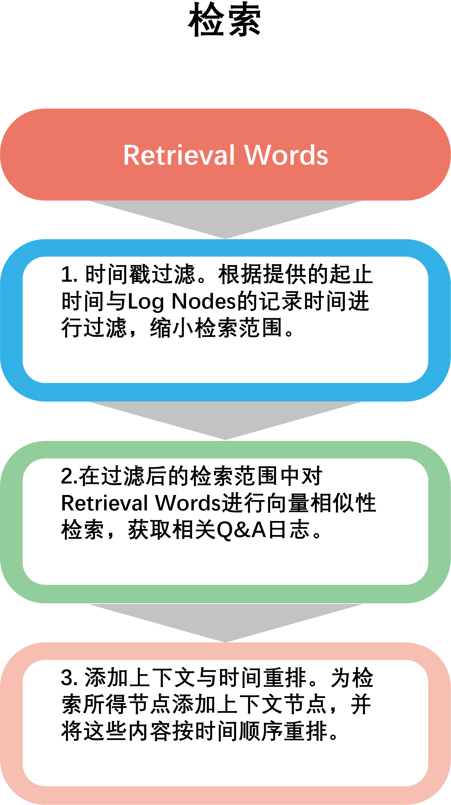

# 交互日志检索

交互日志检索的特点是与时间强相关，因此Labridge采用相似性检索 + 时间戳过滤的检索方式来进行交互日志检索。

## 时间戳过滤：
每个 **QA** 日志节点都记录了相应的时间戳，Labridge根据输入的开始时间与结束时间来对日志节点进行过滤，缩小检索范围。

## 相似性检索：
在经过过滤缩小范围后的日志节点中，根据Query的`Embedding向量`与 **QA** 日志向量的相似性检索出最相似的`relevant_top_k`条交互日志。

## 添加上下文：
由于Labridge与成员之间的交互往往是连续的多轮 `QA`，因此为所有检索结果添加上下文(即之前的QA与之后的QA)，保证交互日志的完整性。

## 按时间重排：
交互日志的特点是时间单向性，日志之间的顺序很大程度影响对话的语义，因此在添加上下文后，对得到的 **QA** 日志节点进行去重与排序，保证交互日志的连贯性。

关于交互日志检索的具体细节参见 **源码文档** `Func_modules.memory.chat.retrieve`