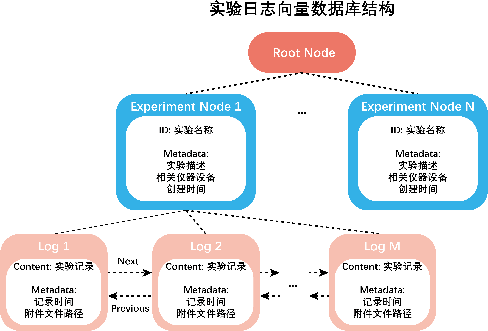

# 个人实验日志存储结构

实验日志存储于一个向量数据库中，结构如下图所示。

- 数据库中存在一个根节点，所有的实验节点是该根节点的子节点。
- 每个实验节点包含如下信息：

  - 实验名称
  - 实验描述
  - 实验相关的仪器设备
  - 本实验记录创建的时间
- 对于每个实验，实验日志被记录为实验节点的子节点，日志节点间按时间顺序形成类似双向链表的结构。
- 日志节点包含如下信息：

  - 实验结果
  - 记录时间

当实验室成员要求Labridge帮助记录实验结果时，Labridge会将该实验结果记录进其实验日志数据库中的对应实验记录中。

更多有关个人实验日志存储结构的细节参见 **源码文档** `Func_modules.memory.experiment.experiment_log`