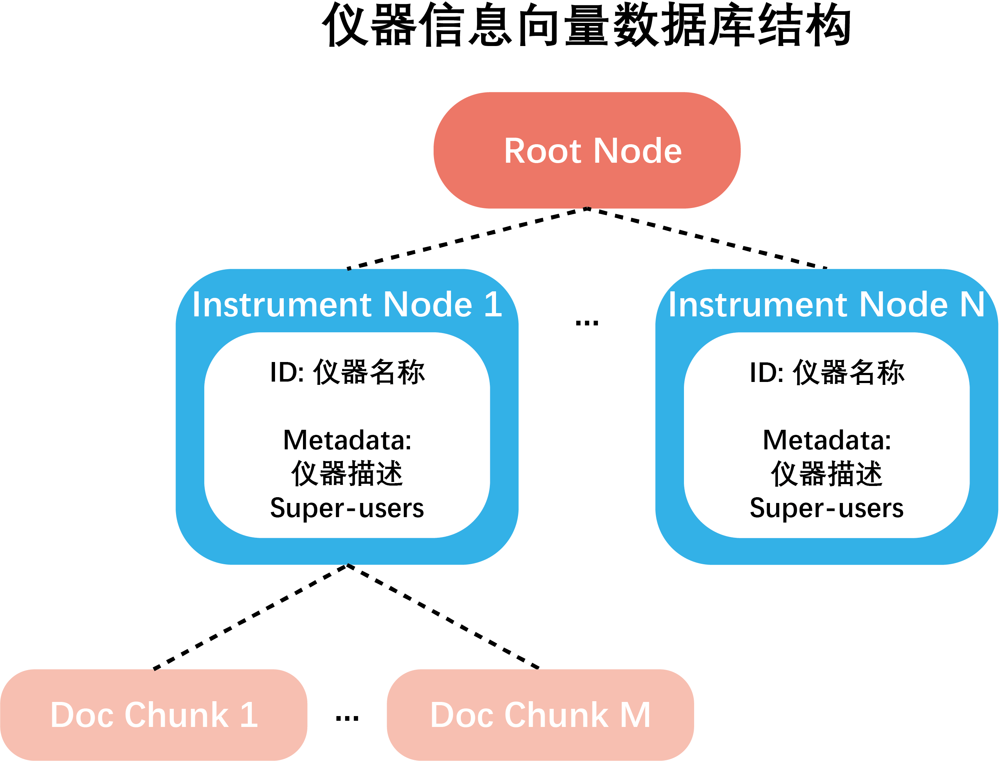

# 仪器信息存储结构

实验仪器信息存储于一个向量数据库中, 其结构如下图所示。

- 数据库中存在一个根节点，所有的仪器节点是该根节点的子节点。
- 每个仪器节点包含如下信息：

  - 仪器名称
  - 仪器描述
  - Super Users (负责管理仪器信息、对仪器具有完全权限的实验室成员)
- 对于每个仪器，仪器信息被记录为仪器节点的子节点，如使用规范，操作手册，仪器参数等。

更多关于仪器信息存储结构的细节参见 **源码文档** `Func_modules.instrument.store.instrument_store`