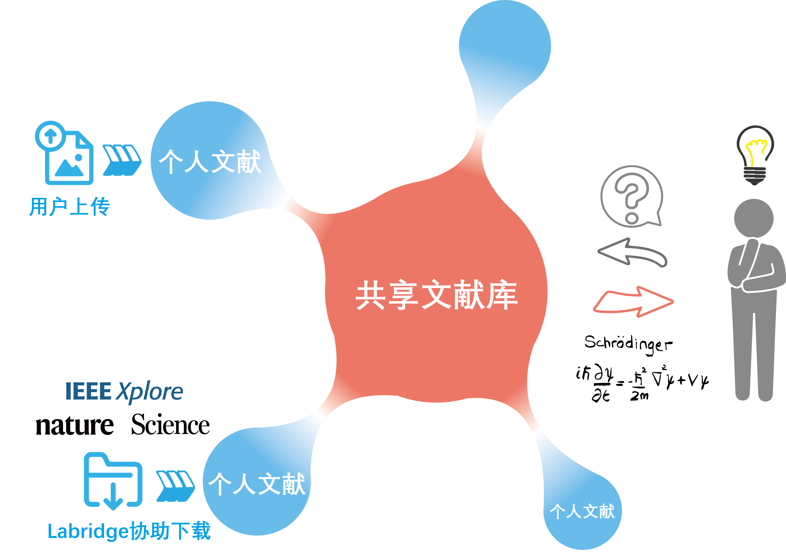

# 文献管理

## _“在知识的流动中催化新知识的诞生”_

一个优秀的研究者应该追踪研究领域内的最新研究成果，同时保持对新领域的好奇与开放，因为许多伟大的科学成就往往来自于不同领域间的思维碰撞。

因此文献管理是一个科学实验室至关重要的部分之一。我们希望Labridge能够帮助研究者们管理这些宝贵的知识财富，并构建实验室的共享文献知识库，
为实验室成员之间的科研交流与合作提供平台。

Labridge通过如下方式促进文献知识的流动与知识的交叉融合：

## **实验室共享文献库**：
Labridge收集实验室所有成员的文献构成[共享知识库](./shared_papers/index.md)。Labridge会依据共享知识库的内容回答实验室成员的相关问题，
并提供参考内容的来源（如这篇文献来自于成员XXX）。让知识的流动不受时间与空间的限制。
## **个人近期文献**：
Labridge为每位实验成员提供个人的[近期文献库](./temporary_papers/index.md)，以记录该成员近期通过Labridge从期刊网站下载、向Labridge上传的文献。
Labridge基于近期文献库协助每位成员更好地理解ta最近感兴趣的研究内容。并支持成员通过自然语言管理个人的文献库。

## **文献搜索与下载**：
Labridge提供自然语言交互的文献搜索与下载工具，让研究者保持对领域最新研究动态的追踪。
Labridge目前支持在如下期刊网站进行搜索与下载：

- [arXiv](./temporary_papers/download/arXiv.md)
