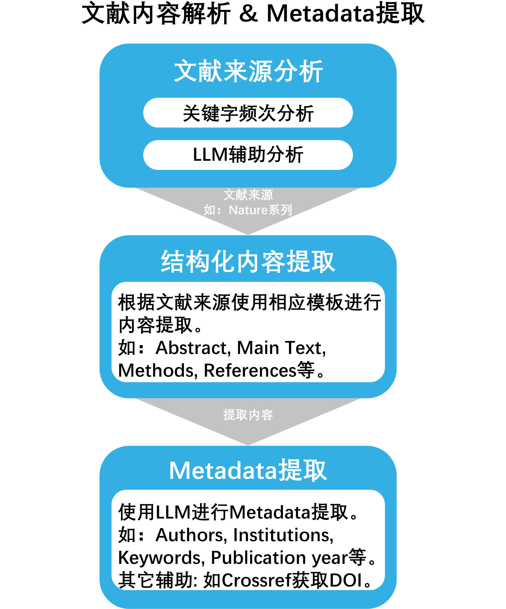

# 文献内容解析与提取

为了使构建的共享文献知识库支持更加精准的检索，我们对收集的文献文件进行细致的解析与内容提取。

## **文献来源分析**：
我们通过 **结构化PDF解析**、**关键字频次分析**、**LLM辅助分析** 等多种手段对一篇PDF文献的来源进行分析，
如该文献来自于`Nature`、`IEEE`等。
具体的细节请参考 **源码文档**:`Fun_modules.paper.parse.extractors.source_analyze`

## **文献结构化解析**：
根据分析出的文献来源，我们使用相应的解析模板对文献进行解析，如将其内容中的 
`Abstract`, `MainText`, `Methods`, `References` 等提取出来，以支持更精准的文献库检索。
Labridge目前支持的解析模板包括：
  - Nature Parser: 参见 **源码文档** `Fun_modules.paper.parse.parsers.nature_parser`
  - IEEE Parser: 参见 **源码文档** `Fun_modules.paper.parse.parsers.ieee_parser`

## **Metadata提取**：
Labridge利用 **LLM** 对文献的Metadata进行提取，如 **文章标题**、**文章关键词**、**作者信息**、**作者单位**、**发表时间** 等。
Labridge从期刊网站上下载的文献往往已经包含了充分的Metadata,对于这类文献，在本环节会对其中未提供的Metdata进行补充。
具体细节参见源码文档 `Fun_modules.paper.parse.extractors.metadata_extract`

<figure class="figure-image">
  
  <figcaption>Metadata提取示例</figcaption>
</figure>