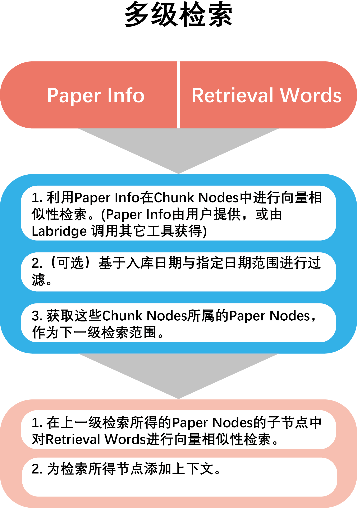

# 个人临时文献库检索

对于个人临时文献库的检索，我们同样采用了多级混合检索。个人临时文献库的使用场景更多地是针对某一篇特定文献进行询问，
且对于时效性有较高要求。因此我们采用了 模糊检索定位文献范围 + 进一步相似性检索 的策略。

## 模糊检索确定文献范围
首先，Labridge会从工具调用日志以及聊天记录中确定所需文献的大致信息(**PaperInfo**)（如标题、文件路径等）。
根据该PaperInfo，Labridge在个人临时文献库中进行相似性检索获得相关nodes，这些nodes所属的文献即为Labridge在
下一步检索中的检索范围。

## 日期过滤
Labridge可以提供起止时间来进一步缩小检索范围。

## 进一步检索
在这一步检索中，Labridge在上一步检索的文献范围中，根据用户的检索文本进行相似性检索，并获得最相关的内容节点(doc nodes)

## 添加上下文
可以选择为检索得到的结果添加上下文，作为最终结果传给 **LLM**，以避免文本分块导致的内容不完整。
