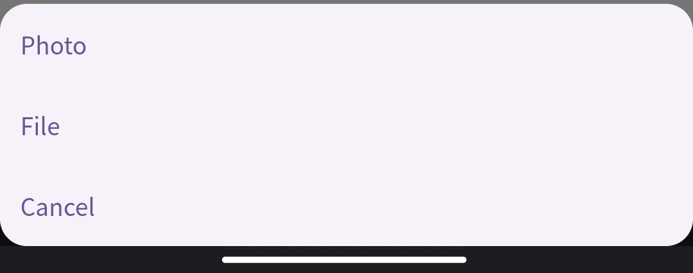

# App交互界面

我们为用户与Labridge的交互提供app交互界面，如下图所示。


## 多样化交互方式

Labridge支持多样化的交互方式：文字，语音，文件等；

Labridge还支持使用户介入智能体的思考与决策的开发者模式。




## 支持附件文件预览


## App代码描述与编译说明

App使用Flutter框架开发，支持Windows、MacOs、Android、Web、iOS等多种平台。目前已在
Windows、Andriod、Web三端进行了全面测试。

### 环境

> 环境信息参考自flutter doctor命令

- Flutter (Channel stable, 3.24.0, on Microsoft Windows [版本 10.0.22631.4169], locale zh-CN)
- Windows Version (Installed version of Windows is version 10 or higher)
- Android toolchain - develop for Android devices (Android SDK version 33.0.0)
- Chrome - develop for the web
- Visual Studio - develop Windows apps (Visual Studio Community 2022 17.11.3)
- Android Studio (version 2024.1)
- VS Code (version 1.93.0)

### 主体代码

主体代码存放于`/app/lib`下：

```sh
lib
│  chat_agent.dart
│  main.dart
│  settings.dart
│  settings_route.dart
│  pdf_viewer_route.dart
│
└─message
        audio_message.dart
```

其中`main.dart`文件为主页面UI文件，`chat_agent.dart`负责与大模型进行通信，处理用户请求，其余文件则被用于维护UI状态。

### 编译

该APP完全按照Flutter标准开发，编译流程请参考[Flutter官方文档](https://docs.flutter.dev/deployment/android)
