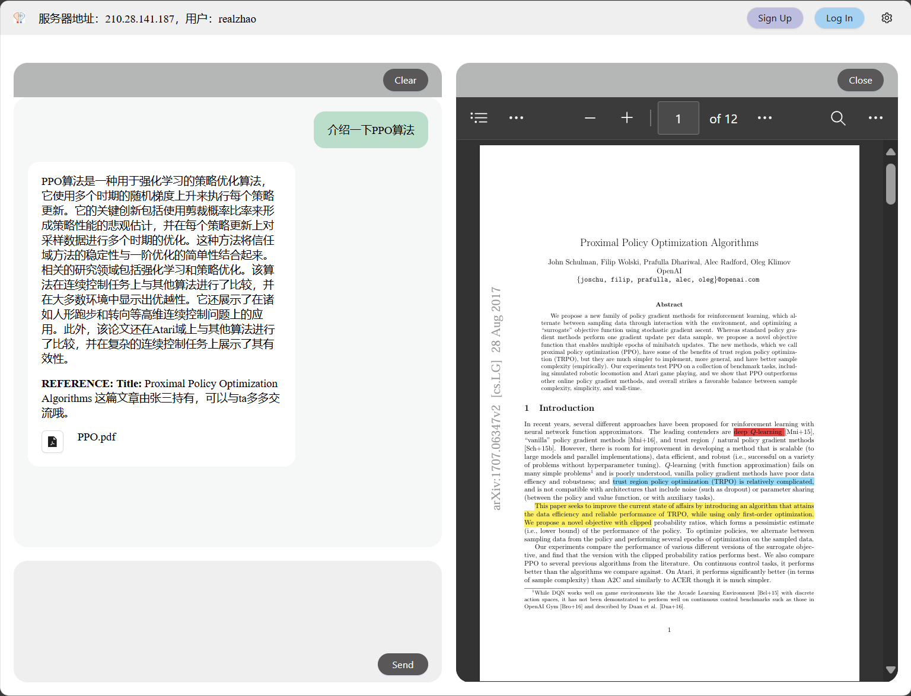
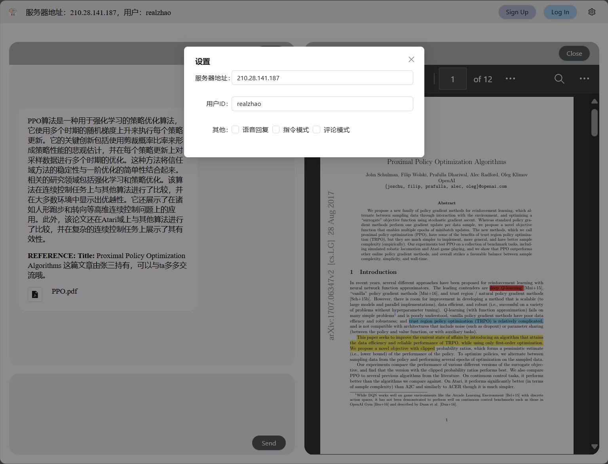

# Web 交互界面

我们为用户与 Labridge 的交互提供 web 交互界面，如下图所示。上部工具栏可查看服务器地址、当前用户，进行登录、修改设置等操作。左侧为聊天窗口，可用于输入和查看聊天内容。右侧为文件展示窗口，可用于阅读推荐的论文。



支持自定义服务器地址等多个参数



## Web 界面代码描述与编译流程

web 项目代码在目录 `web-frontend-2` 下，使用 Vite + React + Typescript

预览：

```ps1
python -m http.server -d .\web-frontend-2\dist\
```

然后浏览器访问 `http://localhost:8000/`，如需修改服务器地址，可在设置中修改：


编译：

```ps1
cd web-frontend-2
npm run dev # 开发模式，实时修改与浏览
npm run build # 打包，用于发布
```
